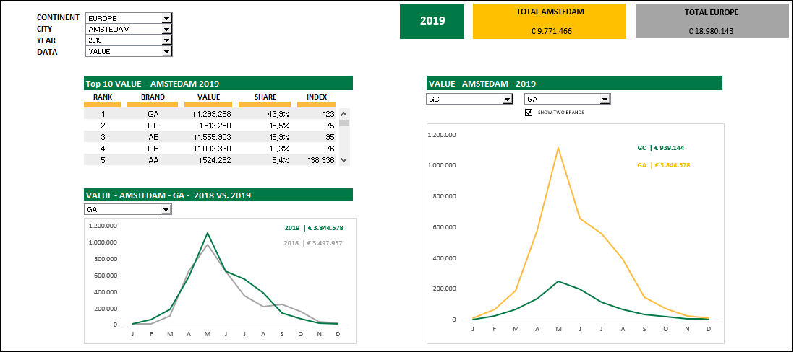

# Market Data Dashboard

I am responsible for making market data available to the marketing and sales teams. I generally create a variety of pivot tables and use extensive conditional formatting and calculated fields to improve readability. However, I realized that some colleagues were struggling to find relevant information and the correct interpretation of the tables. I challenged myself to create a fully dynamic dashboard in Excel 365

  - Created an anonymized market data dashboard using formulas and the Developer tab in Excel 365
  - Created a dynamic dashboard without the use of VBA, Power Excel or Power BI

